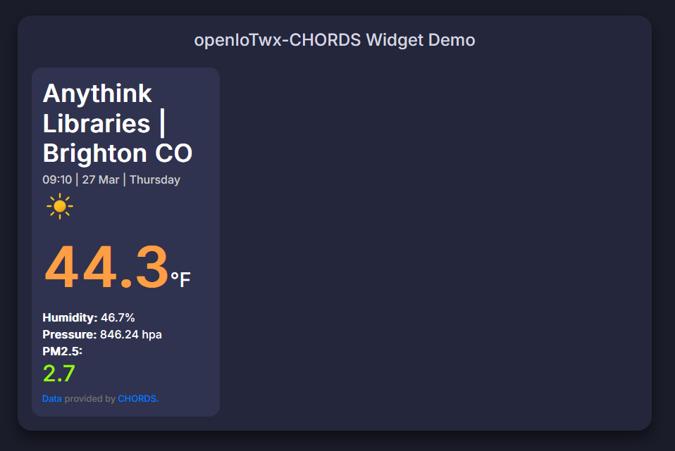

# openIoTwx-CHORDS Widget Demo


This widget shows CHORDS data in a simple Javascript widget.




## Usage


See the [index.html](./index.html) file for a working example.

You will need to include `script.js` somewhere in your HTML, get the correct `id` (aka `id` at the top of your dashboard page or the number at the end of your URL `.../instruments/<id>`) from CHORDS that you'd like to display, then add the following code:

```javascript
<script>
    var chords_id = 77; // <== the CHORDS ID you want to display
</script>
<script src="script.js">
</script>
```
## Attribution


This widget was modified from the great work of [theSV30](https://github.com/theSV30), which
provided the key ingredients to get this remix started, 
including the fonts, CSS and layout.

See:

* https://github.com/theSV30/weather-widget
